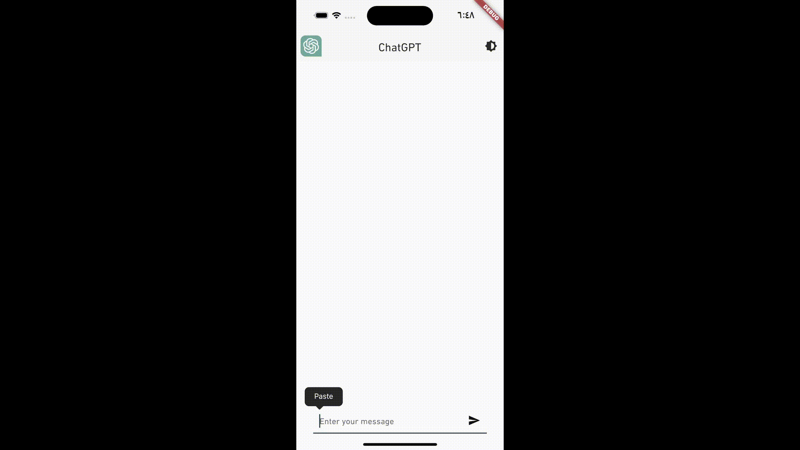

# OVERVIEW

- Created using the new "gpt-3.5-turbo" AI model
- By default, the api does not remember conversations, the solution was to send with each message, a list of previous history messages to the model so it responds correctly.

# Installation

- `git clone https://github.com/HoussemBousmaha/chatgpt.git`
- `cd chatgpt`
- `flutter create --platforms <your-prefered-platforms (ex: macos, ios, android)> .`
- `flutter pub get`
- `flutter pub run build_runner build --delete-conflicting-outputs`
- `flutter run --release --dart-define=OPENAI_API_KEY=<your-openai-api-key>`

# Preview

